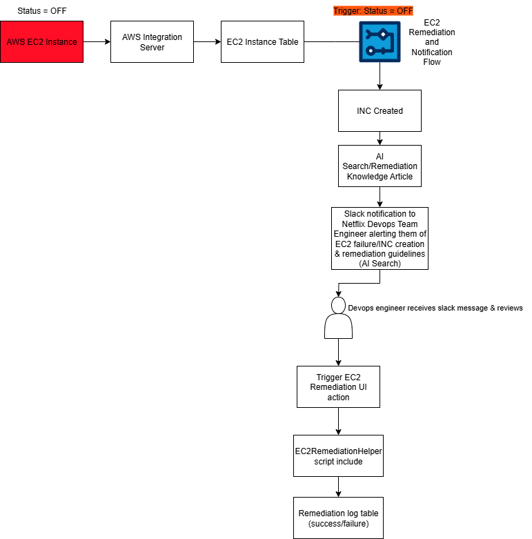

# ec2-remediation-system  

A ServiceNow-based incident response system built to help Netflix DevOps quickly respond to AWS EC2 failures. The system automatically creates incidents, surfaces AI-powered remediation steps, sends alerts through Slack, and allows engineers to trigger fixes directly from ServiceNow to reduce downtime and protect the streaming experience.  

---

# Implementation Steps  

## 1. Scoped Application (ServiceNow Studio)  
The implementation began in **ServiceNow Studio**, where I created a scoped application named **EC2 Monitoring and Remediation**.  

Using a scoped application ensured that all custom components were isolated from global changes and could be managed independently.  

The scope name (`x_snc_ec2_monito_0`) was critical because Netflix’s AWS Integration Server depends on this namespace to correctly identify where to push EC2 data for monitoring. Without the proper scope, EC2 instance data would not populate into ServiceNow.  

---

## 2. Custom Tables  
Two custom tables were created inside the application to support monitoring and auditing:  

- **EC2 Instance Table**  
  Stores real-time AWS instance information. Required fields include:  
  - Instance Name (String, 40)  
  - Instance ID (String, 40)  
  - Instance Status (String, 40, populated by AWS Integration Server with ON/OFF)  
  - Created / Updated (auto-generated by ServiceNow)

  - The AWS Integration Server automatically populates this table every minute and, for testing, forces the status to OFF every 10 minutes.  
  - This ensures the flow can be consistently validated against simulated EC2 failures.

- **Remediation Log Table**  
  - Records every remediation attempt with full audit details. Required fields include:  
  - EC2 Instance (Reference to EC2 Instance table)  
  - Attempted Status (String, 40)  
  - Success (True/False)  
  - Timestamp (Date/Time)  
  - Request Payload (String, 4000)  
  - Response Payload (String, 4000)  
  - HTTP Status Code (Integer)  
  - Error Message (String, 4000)  
  - These logs provide Netflix DevOps with end-to-end visibility into what actions were taken, how AWS responded, and whether the remediation succeeded.  

---

## 3. AWS Integration Setup  
To connect ServiceNow with the AWS Integration Server, I configured secure integration points:  

- **Connection & Credential Alias**: `AWS Integration Server C C Alias`

- **HTTP Connection**: `AWS Integration Server Connection` with the AWS server host and base path.

- **Basic Auth Credential**: `AWS Integration Server Credentials`, which required my ServiceNow instance username and password.  

These records abstract sensitive values into reusable credentials so that **Flow Designer** and **Script Includes** can use them without exposing authentication directly in code.  

---

 
## 4. UI Action and Script Include  

### UI Action: Trigger EC2 Remediation 

**Functionality**  
When an engineer clicks the button on an EC2 Instance record, the client script fires. It:  
1. Passes the current record’s `sys_id` to the server.  
2. Calls the `EC2RemediationHelper` Script Include using GlideAjax.  
3. Waits for the server to respond and then notifies the engineer whether the remediation attempt worked or failed.    

 **UI Action Record (Admin View)** 

**Form Button (Engineer View)** 

---

### Script Include: EC2RemediationHelper  

**Functionality**  
The Script Include contains the logic to actually perform the remediation. When called by the UI Action, it:  
1. Looks up the EC2 Instance record in ServiceNow using the provided `sys_id`.  
2. Pulls the instance details (name, ID, and current status).  
3. Builds a REST API call using the Connection & Credential Alias, HTTP Connection, and Basic Auth configured.  
4. Sends the remediation request to the AWS Integration Server.  
5. Records the request and response in the Remediation Log table, including status codes, payloads, and whether the call succeeded.  
6. Returns a message back to the client so the engineer knows immediately if the remediation worked.  

 
---

## 5. Workflow Automation (Flow Designer)  
Automation was designed in **Flow Designer**, where a flow triggers whenever an **EC2 Instance status = OFF**.  

The flow executes three critical actions:  

### Incident Creation  
A new **Incident record** is automatically generated with full mapping of fields:  

- **Caller**: System Administrator  
- **Category**: Cloud  
- **Subcategory**: EC2  
- **Short Description**: `EC2 Instance Failure`  
- **Description**: This incident was automatically generated by the EC2 Monitoring and Remediation flow. Failure Details:
  Instance Name: ${Instance Name}, Instance ID: ${Instance ID},Current Status: ${Instance Status}
- **Impact**: 1 - High  
- **Urgency**: 1 - High

An **Assignment Rule** ensures that incidents with Category = Cloud and Subcategory = EC2 are automatically routed to the **Netflix DevOps assignment group**.  

### AI Search Integration  
The flow uses **AI Search** to automatically query for remediation articles based on EC2-related keywords.  
- Results are attached to the incident.  
- Guidance is also included in notifications for faster troubleshooting.  
- System logs confirm execution of the AI Search step for validation.

### Slack Notification  
The final step in the flow posts a structured message to the Netflix DevOps Slack channel using an incoming webhook.  

The Slack payload includes:  
- Instance Name  
- Instance ID  
- Instance Status
- Incident Number (with confirmation that it has been assigned to the Netflix DevOps team)  
- Remediation Guidance (retrieved via AI Search)  

This ensures engineers receive real-time alerts with both system failure details and actionable remediation instructions without leaving Slack.  

## 6. Knowledge Base and AI Search  
To support AI-driven troubleshooting, I created a Knowledge Base article with a natural language title:  

**“How to remediate a failed AWS EC2 instance from ServiceNow”**  

Details of the article:  
- **Content**: Step-by-step remediation instructions (navigate to the module, open the EC2 Instance, click Trigger EC2 Remediation, review logs).  
- **Keywords**: EC2, server, instance, restart, AWS, virtual machine, cloud server, reboot.  
- **Access Control**: Configured the form layout and added `Can Read` and `Cannot Read` fields so only the Netflix DevOps team could access it.  

 
---

## 7. Application Access  
For security, I leveraged the default admin role generated with the scoped application:  

1. Added the role to the **EC2 Monitoring and Remediation** application.  
2. Assigned the role to the **Netflix DevOps group**.  

This ensured that only Netflix DevOps engineers had access to the application and its related modules (EC2 Instances and Remediation Logs). No other teams could view or interact with the tables.  

## 8. Testing and Validation  

End-to-end testing confirmed that the system/flow works as expected!  

# Architecture Diagram
  

# Optimization

When I designed the EC2 Monitoring and Remediation system, my focus was not just on functionality but on making it efficient and reliable for the Netflix DevOps team. Here are the key improvements I introduced:

- **Scoped Application for Isolation**  
  Instead of building on global tables, I created a dedicated scoped application. This prevented conflicts with global configurations and ensured all custom tables, flows, and scripts were neatly contained.

- **Automated Workflows Instead of Manual Steps**  
  Previously, engineers would have to manually detect failures and look up remediation guidance. I replaced that process with a Flow Designer flow that automatically creates incidents, attaches remediation guidance via AI Search, and notifies DevOps through Slack in real time. This eliminated delays and reduced manual effort.

- **One-Click Remediation With Full Audit Trail**  
  To reduce downtime, I gave engineers a one-click remediation button directly on the EC2 Instance record. Every action taken through this button is logged in the Remediation Log table, providing accountability and visibility into what happened, when, and why.

- **Credential Security and Reusability**  
  Rather than hard-coding credentials, I used ServiceNow’s Connection & Credential framework. This allows integrations to securely authenticate without exposing usernames or passwords, making the setup both more secure and reusable for future integrations.

- **Role-Based Access for Reliability**  
  I added the application’s default admin role to the Netflix DevOps group. By restricting visibility to only DevOps engineers, the system is more reliable because no outside teams can accidentally trigger or interfere with remediation actions.

Together, these choices improved both efficiency (by cutting down on manual effort and giving engineers instant tools) and reliability (by securing access, logging every action, and preventing conflicts with global changes).

# DevOps Usage

For Netflix DevOps engineers, the workflow looks like this:  

1. **Review Slack Notification**  
   - When an EC2 instance goes **OFF**, a Slack message is posted to the Netflix DevOps channel.  
   - The message includes:  
     - The failing Instance ID  
     - The related Incident number  
     - A summary of AI Search remediation guidance  

2. **Trigger Remediation in ServiceNow**  
   - Navigate to the EC2 Instance record linked in the system.  
   - Click **Trigger EC2 Remediation** to initiate the fix via the AWS Integration Server.  
   - You’ll see an on-screen confirmation showing whether the remediation attempt succeeded or failed.  

3. **Verify in the Remediation Log**  
   - Check the **Remediation Log table** for the full audit trail:  
     - Request and Response payloads  
     - HTTP Status Code (e.g., 201 = success, 401 = unauthorized)  
     - Timestamp and Success flag  
   - This ensures accountability and helps engineers confirm the exact outcome.  

4. **Review and Resolve the Incident**  
   - Open the automatically generated incident record using the number provided in Slack.  
   - Confirm that the Instance has been restored to “ON” status.  
   - Add work notes referencing the remediation attempt and outcome.  
   - If successful, set the Incident to **Resolved**.  
   - If remediation fails, document the failure and escalate to the next support tier.  

